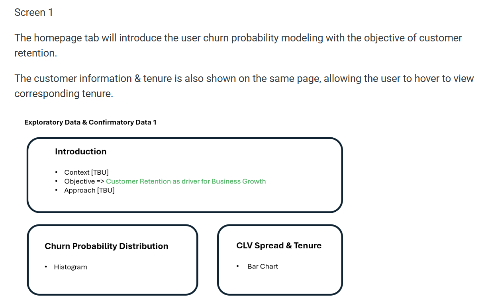
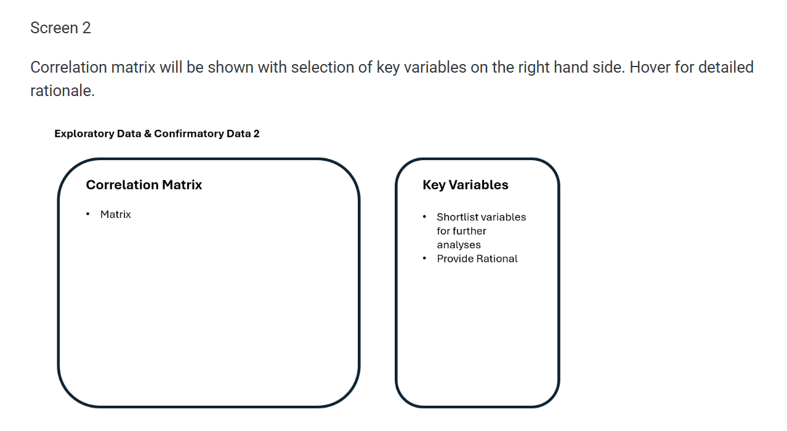
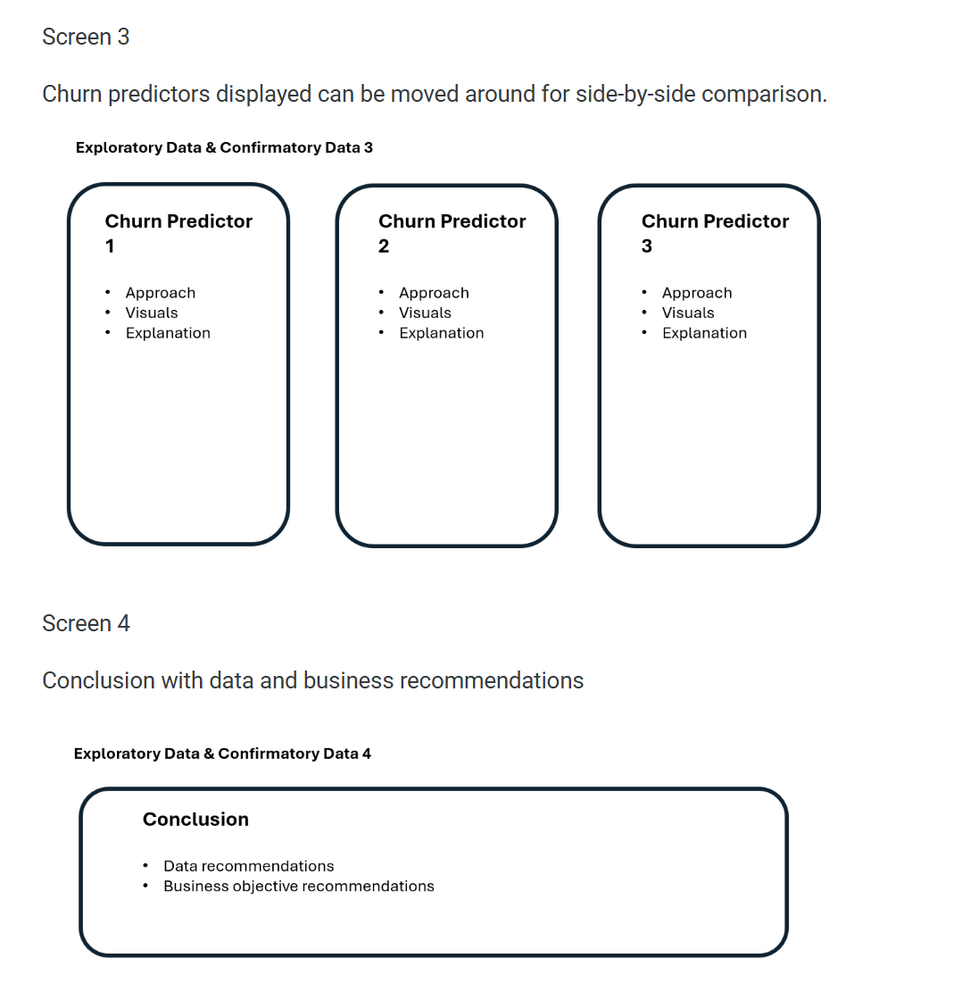
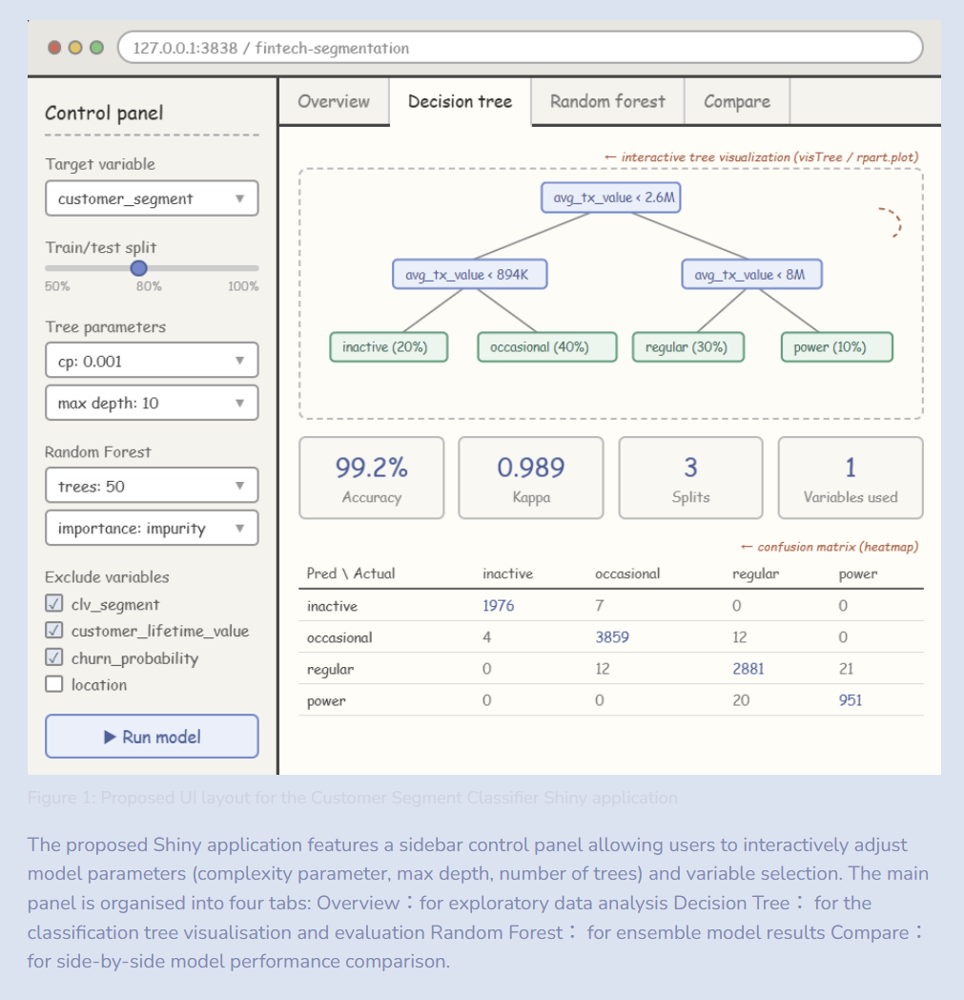

## FinSight — Democratising Customer Analytics for Colombian Fintech

## 1. Motivation

The rise of fintech has generated unprecedented volumes of customer behavioural data. Yet in many organisations, the insights buried within this data remain inaccessible — locked behind technical barriers that prevent non-technical stakeholders from exploring them directly. This creates a gap between the data that exists and the decisions that get made.

The COFINFAD Colombian Fintech Financial Analytics Dataset captures the full customer lifecycle of 48,723 customers from a Colombian fintech company across 2023 — spanning demographics, product holdings, app engagement, transaction behaviour, satisfaction scores, and churn risk. This richness makes it ideal for building a multi-faceted visual analytics application.

**FinSight** is our proposed R Shiny application that democratises access to these analytics. Rather than delivering a static report, FinSight puts the tools of exploratory analysis, statistical testing, customer segmentation, and predictive modelling directly into the hands of the analyst or business user — interactively, and without requiring programming knowledge.

## 2. Objectives

This project aims to build an interactive visual analytics application that enables users to:

1.  **Explore** the distribution of customer demographics, product adoption, satisfaction, and churn risk through interactive visualisations.
2.  **Confirm** statistically whether demographic and behavioural factors significantly influence churn probability and customer lifetime value.
3.  **Discover** hidden customer segments beyond the existing labels using Latent Class Analysis, revealing latent behavioural groupings across product usage, app engagement, and satisfaction.
4.  **Predict** which combination of customer features including latent class assignments derived from clustering best identifies customers with high churn probability, and extract actionable decision rules from the tree structure to guide targeted retention strategies.

## 3. Data

The dataset used is the **COFINFAD — Colombian Fintech Financial Analytics Dataset**, published on Mendeley Data (DOI: 10.17632/mhb4zn3258.1) under a CC BY 4.0 licence.

It consists of two files:

-   **`customer_data.csv`** — 48,723 rows × 54 variables covering customer demographics, product holdings, app engagement, transaction behaviour, satisfaction scores, NPS, and churn probability.
-   **`transactions_data.csv`** — detailed transaction-level records for the same customer base.

Key variables of interest include `churn_probability`, `customer_segment`, `clv_segment`, `satisfaction_score`, `nps_score`, `feature_usage_diversity`, `avg_tx_value`, and product holding flags (`savings_account`, `credit_card`, `investment_account`, etc.).

Three variables required special handling during preparation: `credit_utilization_ratio` (37% missing — imputed as 0 for non-credit-card holders), and `feature_requests` and `complaint_topics` (free-text fields with 33–50% missing — converted to binary presence flags).

## 4. Methodology

The application is organised into four analytical modules, each corresponding to a tab in the Shiny interface.

### 4.1 Exploratory Data Analysis (EDA)

The EDA module provides univariate and bivariate visualisations of the customer dataset. Users can explore the distribution of churn probability, examine correlations among numeric variables through an interactive heatmap, and decompose the age–churn relationship across income bracket and gender groups using faceted plots. Satisfaction scores are examined across CLV segments and customer tenure to surface patterns that motivate the confirmatory tests in the next module.

### 4.2 Confirmatory Data Analysis (CDA)

The CDA module uses formal statistical tests to validate observations from EDA. Pearson correlation tests confirm relationships between age, product count, satisfaction, and churn. One-way and two-way ANOVA tests examine whether income bracket, gender, and CLV segment significantly explain variance in churn probability and satisfaction score. A multiple linear regression model with a coefficient plot quantifies the joint predictive effect of key variables on churn. Users can select variables interactively to build and compare regression models.

### 4.3 Clustering — Latent Class Analysis

Three R packages were evaluated for the clustering module: `poLCA`, `mclust`, and `LCAvarsel`. `poLCA` was selected as it is specifically designed for categorical manifest variables, whereas `mclust` assumes continuous Gaussian distributions unsuitable for binned ordinal data. `LCAvarsel` adds automated variable selection but introduces unnecessary complexity for this use case.

### 4.4 Decision Tree and Random Forest

Two R packages were evaluated for the regression module: rpart and ranger.churn_probability is modeled as a continuous outcome, making this a regression tree analysis. rpart was selected as the primary model for its interpretability: the tree structure allows users to visually trace how splitting rules on variables such as active_products, app_logins_frequency, and satisfaction_score produce churn risk estimates. ranger was included as a benchmark ensemble model, evaluated via R² and RMSE on a held-out test set.

## 5. Prototype Sketches

The FinSight Shiny application uses a `navbarPage()` structure with four tabs. Each tab follows a `sidebarLayout()` pattern — input controls on the left, interactive outputs on the right.

### Tab 1 — EDA

**Inputs:** Variable selector, chart type toggle

**Outputs:** Distribution plots, correlation heatmap, faceted churn vs age chart by income and gender, satisfaction trends by CLV and tenure

### Tab 2 — CDA

**Inputs:** Variable selector for regression, test type selector (correlation / ANOVA / regression)

**Outputs:** Correlation test result, ANOVA summary, regression coefficient plot with R²

{width="100%"} {width="100%"} {width="100%"}

### Tab 3 — Clustering

**Inputs:** `sliderInput` for number of classes (2–7), `sliderInput` for repetitions (1–5), `selectInput` for variable to plot, `actionButton` to run model

**Outputs:** BIC / AIC / Entropy metric boxes, two `plotlyOutput` charts in a `tabsetPanel` (class on x-axis and variable on x-axis)

{width="100%"}

### Tab 4 — Decision Tree

**Inputs:** Complexity parameter, max depth, number of trees sliders, `actionButton` to run

**Outputs:** Pruned tree plot (`rpart.plot`), random forest variable importance chart, side-by-side confusion matrix comparison

{width="100%"}

## 6. R Packages

| Package      | Purpose                                  |
|--------------|------------------------------------------|
| `tidyverse`  | Data wrangling and transformation        |
| `ggplot2`    | Static chart construction                |
| `plotly`     | Interactive charts via `ggplotly()`      |
| `poLCA`      | Latent Class Analysis for clustering     |
| `rpart`      | Classification tree modelling            |
| `rpart.plot` | Decision tree visualisation              |
| `ranger`     | Random forest modelling                  |
| `caret`      | Model evaluation and confusion matrices  |
| `ggcorrplot` | Correlation heatmap                      |
| `broom`      | Tidy model outputs for coefficient plots |
| `patchwork`  | Composite plot layout                    |
| `shiny`      | Web application framework                |
| `DT`         | Interactive data tables                  |

## 7. Project Management

### Team Members and Division of Work

| Member        | Module                        | Shiny Tab     |
|---------------|-------------------------------|---------------|
| Teo Cher In   | EDA + CDA                     | Tab 1 + Tab 2 |
| Cheng Ho Wang | Clustering (LCA)              | Tab 3         |
| Ye Zhili      | Decision Tree + Random Forest | Tab 4         |

### Gantt Chart

```{r}
#| echo: false
#| message: false
#| warning: false

library(tidyverse)
library(ggplot2)

tasks <- data.frame(
  Task = c(
    "Project setup & repo",
    "EDA — analysis & code",
    "CDA — analysis & code",
    "Clustering — LCA",
    "Decision Tree / RF",
    "Proposal write-up",
    "Shiny — EDA tab",
    "Shiny — CDA tab",
    "Shiny — Clustering tab",
    "Shiny — Decision Tree tab",
    "Integration & testing",
    "Project website",
    "Poster design",
    "Final submission"
  ),
Owner = c(
    "All",
    "Teo Cher In", "Teo Cher In",
    "Cheng Ho Wang",
    "Ye Zhili",
    "All",
    "Teo Cher In", "Teo Cher In",
    "Cheng Ho Wang",
    "Ye Zhili",
    "All", "All",
    "All", "All"
  ),
  Start = as.Date(c(
    "2026-03-01",
    "2026-03-01", "2026-03-05",
    "2026-03-01",
    "2026-03-01",
    "2026-03-10",
    "2026-03-18", "2026-03-22",
    "2026-03-18",
    "2026-03-18",
    "2026-03-28", "2026-03-18",
    "2026-03-28", "2026-04-03"
  )),
  End = as.Date(c(
    "2026-03-03",
    "2026-03-09", "2026-03-12",
    "2026-03-15",
    "2026-03-15",
    "2026-03-18",
    "2026-03-25", "2026-03-27",
    "2026-03-25",
    "2026-03-27",
    "2026-04-01", "2026-04-01",
    "2026-04-01", "2026-04-05"
  ))
)

owner_colors <- c(
  "All"      = "#1e2d4a",
  "Teo Cher In" = "#2563eb",
  "Cheng Ho Wang" = "#16a34a",
  "Ye Zhili" = "#d97706"
)

tasks$Task <- factor(tasks$Task, levels = rev(tasks$Task))

ggplot(tasks, aes(xmin = Start, xmax = End, y = Task, fill = Owner)) +
  geom_rect(aes(ymin = as.numeric(Task) - 0.4,
                ymax = as.numeric(Task) + 0.4),
            color = "white", linewidth = 0.4) +
  scale_fill_manual(values = owner_colors) +
  scale_x_date(date_breaks = "1 week", date_labels = "%d %b",
               limits = as.Date(c("2026-03-01", "2026-04-06"))) +
  geom_vline(xintercept = as.numeric(as.Date("2026-03-18")),
             linetype = "dashed", color = "#e11d48", linewidth = 0.7) +
  geom_vline(xintercept = as.numeric(as.Date("2026-04-01")),
             linetype = "dashed", color = "#e11d48", linewidth = 0.7) +
  annotate("text", x = as.Date("2026-03-18"), y = 14.6,
           label = "Proposal\n18 Mar", size = 2.8,
           color = "#e11d48", hjust = 0.5) +
  annotate("text", x = as.Date("2026-04-01"), y = 14.6,
           label = "Poster\n1 Apr", size = 2.8,
           color = "#e11d48", hjust = 0.5) +
  labs(title = "FinSight — Project Timeline",
       x = NULL, y = NULL, fill = "Owner") +
  theme_minimal(base_size = 11) +
  theme(
    panel.grid.major.y = element_blank(),
    panel.grid.minor   = element_blank(),
    axis.text.y        = element_text(size = 9),
    axis.text.x        = element_text(size = 8, angle = 30, hjust = 1),
    legend.position    = "bottom",
    plot.title         = element_text(size = 13, face = "bold")
  )
```
