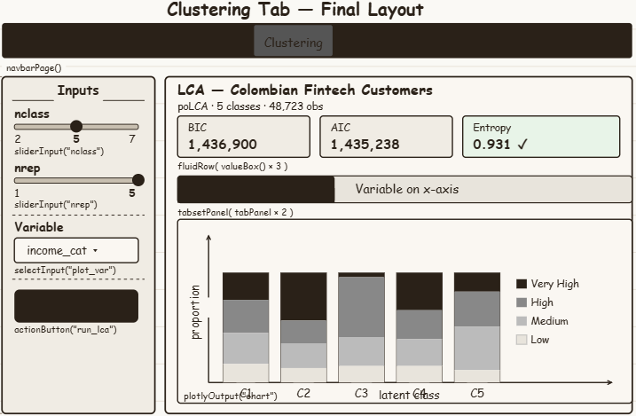

## Load Packages and Data

```{r}
pacman::p_load(poLCA, ggplot2, plotly, tidyverse)

df <- read_csv("customer_data.csv")
```

## Latent Class Analysis

As poLCA expects all variables to start at level 1, binary variables currently in TRUE/FALSE format need to be recoded as 1/2.

Continuous variables also need to be binned into categories of relatively similar sizes.

In addition, variables with imbalanced or many categories will be recoded into broader (and fewer) categories.

Two variables — `customer_segment` and `avg_tx_value` — were found to perfectly predict class membership in preliminary runs, meaning each class was composed entirely of one category. Including such variables causes the LCA to simply rediscover the pre-existing segmentation rather than revealing latent groupings. They are therefore retained in the dataset for visualisation purposes but excluded from the LCA formula.

```{r}
df_clustering <- df %>%

  mutate(
    savings_account    = ifelse(savings_account    %in% c(TRUE, "TRUE"), 2, 1),
    credit_card        = ifelse(credit_card        %in% c(TRUE, "TRUE"), 2, 1),
    personal_loan      = ifelse(personal_loan      %in% c(TRUE, "TRUE"), 2, 1),
    investment_account = ifelse(investment_account %in% c(TRUE, "TRUE"), 2, 1),
    insurance_product  = ifelse(insurance_product  %in% c(TRUE, "TRUE"), 2, 1),
    bill_payment_user  = ifelse(bill_payment_user  %in% c(TRUE, "TRUE"), 2, 1),
    auto_savings       = ifelse(auto_savings_enabled %in% c(TRUE, "TRUE"), 2, 1)
  ) %>%

  mutate(income_cat = case_when(
    income_bracket %in% c("Low")       ~ "Low",
    income_bracket %in% c("Medium")    ~ "Medium",
    income_bracket %in% c("High")      ~ "High",
    income_bracket %in% c("Very High") ~ "Very_High",
    TRUE ~ "Unknown"
  )) %>%

  mutate(segment_cat = case_when(
    customer_segment == "inactive"   ~ "Inactive",
    customer_segment == "occasional" ~ "Occasional",
    customer_segment == "regular"    ~ "Regular",
    customer_segment == "power"      ~ "Power",
    TRUE ~ "Unknown"
  )) %>%

  mutate(clv_cat = recode(clv_segment,
    `Bronze`   = "Bronze",
    `Silver`   = "Silver",
    `Gold`     = "Gold",
    `Platinum` = "Platinum"
  )) %>%

  mutate(login_cat = cut(app_logins_frequency,
                         breaks = c(-Inf, 10, 20, 35, Inf),
                         labels = c("Low", "Medium", "High", "Very_High"))) %>%

  mutate(feature_cat = cut(feature_usage_diversity,
                           breaks = c(-Inf, 1, 3, 5, Inf),
                           labels = c("1", "2-3", "4-5", "6+"))) %>%

  mutate(tx_count_cat = cut(tx_count,
                            breaks = c(-Inf, 15, 30, 60, Inf),
                            labels = c("Low", "Medium", "High", "Very_High"))) %>%

  mutate(avg_tx_cat = cut(avg_tx_value,
                          breaks = c(-Inf, 1000000, 3000000, 8000000, Inf),
                          labels = c("Low", "Medium", "High", "Very_High"))) %>%

  mutate(tx_freq_cat = cut(transaction_frequency,
                           breaks = c(-Inf, 0.03, 0.06, 0.15, Inf),
                           labels = c("Infrequent", "Occasional", "Regular", "Frequent"))) %>%

  mutate(weekend_cat = cut(weekend_transaction_ratio,
                           breaks = c(-Inf, 0.2, 0.35, 0.5, Inf),
                           labels = c("Low", "Medium", "High", "Very_High"))) %>%

  mutate(satisfaction_cat = cut(satisfaction_score,
                                breaks = c(-Inf, 3, 4, 5, Inf),
                                labels = c("Low", "Medium", "High", "Very_High"))) %>%

  mutate(nps_cat = cut(nps_score,
                       breaks = c(-Inf, -50, 0, Inf),
                       labels = c("Detractor", "Passive", "Promoter"))) %>%

  mutate(sentiment_cat = case_when(
    feedback_sentiment == "Positive" ~ "Positive",
    feedback_sentiment == "Neutral"  ~ "Neutral",
    feedback_sentiment == "Negative" ~ "Negative",
    TRUE ~ "Neutral"
  )) %>%

  mutate(churn_cat = cut(churn_probability,
                         breaks = c(-Inf, 0.25, 0.40, Inf),
                         labels = c("Low", "Medium", "High"))) %>%

  select(customer_id,
         income_cat, clv_cat,
         savings_account, credit_card, personal_loan,
         investment_account, insurance_product,
         bill_payment_user, auto_savings,
         login_cat, feature_cat,
         tx_count_cat, tx_freq_cat, weekend_cat,
         satisfaction_cat, nps_cat, sentiment_cat,
         churn_cat,
         segment_cat, avg_tx_cat)
```

Once the dataset is prepared, all variables are converted into factors and checked to ensure there are no missing values.

```{r}
df_clustering <- df_clustering %>% drop_na()

df_clustering[-1] <- lapply(df_clustering[-1], factor)

sapply(df_clustering, function(x) sum(is.na(x)))
```

We can then run the model by specifying the number of classes and the number of repeats. If `nrep > 1`, a global search is done to find the lowest BIC score. Note that `customer_segment` and `avg_tx_value` are excluded from the formula as they were found to dominate class separation in preliminary runs.

```{r}
set.seed(1234)

f <- as.formula(cbind(
  income_cat, clv_cat,
  savings_account, credit_card, personal_loan,
  investment_account, insurance_product,
  bill_payment_user, auto_savings,
  login_cat, feature_cat,
  tx_count_cat, tx_freq_cat, weekend_cat,
  satisfaction_cat, nps_cat, sentiment_cat,
  churn_cat
) ~ 1)

LCA_model <- poLCA(f, df_clustering, nclass = 5, nrep = 5, maxiter = 5000)
```

## Plot BIC Score

```{r}
LCA_model$bic
```

## Plot AIC Score

```{r}
LCA_model$aic
```

## Plot Entropy

Entropy indicates how accurately the model defines classes. In general, an entropy value close to 1 is ideal and above 0.8 is acceptable. Anything below 0.6 is likely to be a suggestion of poor classification.

```{r}
entropy <- function(p) sum(-p * log(p))
error_prior <- entropy(LCA_model$P)
error_post  <- mean(apply(LCA_model$posterior, c(1, 2), entropy), na.rm = TRUE)
LCA_entropy <- (error_prior - error_post) / error_prior
LCA_entropy
```

## Class Interpretation

Based on the conditional item response probabilities from the LCA model, the 5 latent classes can be interpreted as follows. The model fit is strong, with an entropy of 0.931 indicating well-separated and clearly defined classes.

**Class 1 — Mainstream Mid-Income Savers (36.2%)**
The largest class, making up over a third of all customers. They skew toward High income (47%) and hold savings accounts (84%) and credit cards (64%), but show lower uptake of investment accounts (41%) and personal loans (30%). Feature usage is narrow, concentrated at 2-3 features. CLV is spread across all tiers with a slight Bronze lean. Churn risk is predominantly Medium (70%), suggesting a stable but not deeply committed segment. These are everyday banking customers with room to grow into broader product adoption.

**Class 2 — Full-Product Power Users (21.4%)**
This class has the highest product adoption of all five classes — near-universal savings account ownership (99.9%), strong credit card (94.5%), personal loan (56%), and investment account (74%) uptake. Feature usage diversity is the highest, with 49% using 4-5 features and 20% using 6 or more. Transaction counts are moderate-to-high. CLV is evenly spread across all tiers. These are the bank's most engaged, multi-product customers and a key segment for retention and premium product offerings.

**Class 3 — Single-Feature Minimal Users (17.4%)**
Class 3 is strikingly defined by a single characteristic: every customer in this class uses exactly one app feature (feature_cat Pr(1) = 1.0). Product adoption is the lowest across all classes — only 43% hold a savings account, 25% have a credit card, and just 15% have an investment account. Transaction counts are low-to-moderate. Satisfaction scores are predominantly Medium and churn risk is low-to-medium. These customers are using the platform in a very limited way and represent the strongest opportunity for feature engagement and cross-selling campaigns.

**Class 4 — Dissatisfied At-Risk Customers (5.9%)**
The smallest but most critical class. Every customer in this class has Low satisfaction (satisfaction_cat Pr(1) = 1.0), and 84% are NPS Detractors — the only class with meaningful Detractor presence. Churn risk is the highest of all classes, with 37% classified as High churn. CLV is predominantly Gold (70%), meaning this is not a low-value segment — these are moderately valuable customers who are actively dissatisfied. Immediate intervention through service recovery and targeted outreach is strongly recommended.

**Class 5 — High-Volume Transaction Users (19.1%)**
Class 5 is defined by exceptionally high transaction activity — nearly 50% fall in the Very_High transaction count bucket, far above all other classes. CLV is predominantly Gold (70%), reflecting the value generated through volume. Credit card (60%) and savings account (80%) adoption are solid, though investment account ownership (37%) is relatively low. Satisfaction and churn metrics are similar to Class 1. These are transactionally active customers who rely heavily on the platform for payments and transfers but have not diversified into wealth or lending products.

## Visualising Results

The model classification is appended to the original dataset for plotting of the variables to compare across the classes.

```{r}
df_clustering$class <- LCA_model$predclass
df_clustering$class <- factor(df_clustering$class)
```

### Income Bracket

```{r}
plot_table <- df_clustering %>%
  group_by(income_cat, class) %>%
  summarise(counts = n()) %>%
  ungroup

p1 <- ggplot(plot_table, aes(fill = income_cat, y = counts, x = class)) +
  geom_bar(position = "fill", stat = "identity")

fig1 <- ggplotly(p1)
fig1
```

```{r}
p2 <- ggplot(plot_table, aes(fill = class, y = counts, x = income_cat)) +
  geom_bar(position = "fill", stat = "identity")

fig2 <- ggplotly(p2)
fig2
```

### CLV Segment

```{r}
plot_table <- df_clustering %>%
  group_by(clv_cat, class) %>%
  summarise(counts = n()) %>%
  ungroup

p1 <- ggplot(plot_table, aes(fill = clv_cat, y = counts, x = class)) +
  geom_bar(position = "fill", stat = "identity")

fig1 <- ggplotly(p1)
fig1
```

```{r}
p2 <- ggplot(plot_table, aes(fill = class, y = counts, x = clv_cat)) +
  geom_bar(position = "fill", stat = "identity")

fig2 <- ggplotly(p2)
fig2
```

### Product Adoption — Credit Card

```{r}
plot_table <- df_clustering %>%
  mutate(credit_card = ifelse(credit_card == 2, "Has Credit Card", "No Credit Card")) %>%
  group_by(credit_card, class) %>%
  summarise(counts = n()) %>%
  ungroup

p1 <- ggplot(plot_table, aes(fill = credit_card, y = counts, x = class)) +
  geom_bar(position = "fill", stat = "identity")

fig1 <- ggplotly(p1)
fig1
```

```{r}
p2 <- ggplot(plot_table, aes(fill = class, y = counts, x = credit_card)) +
  geom_bar(position = "fill", stat = "identity")

fig2 <- ggplotly(p2)
fig2
```

### Investment Account

```{r}
plot_table <- df_clustering %>%
  mutate(investment_account = ifelse(investment_account == 2, "Has Investment", "No Investment")) %>%
  group_by(investment_account, class) %>%
  summarise(counts = n()) %>%
  ungroup

p1 <- ggplot(plot_table, aes(fill = investment_account, y = counts, x = class)) +
  geom_bar(position = "fill", stat = "identity")

fig1 <- ggplotly(p1)
fig1
```

```{r}
p2 <- ggplot(plot_table, aes(fill = class, y = counts, x = investment_account)) +
  geom_bar(position = "fill", stat = "identity")

fig2 <- ggplotly(p2)
fig2
```

### App Login Frequency

```{r}
plot_table <- df_clustering %>%
  group_by(login_cat, class) %>%
  summarise(counts = n()) %>%
  ungroup

p1 <- ggplot(plot_table, aes(fill = login_cat, y = counts, x = class)) +
  geom_bar(position = "fill", stat = "identity")

fig1 <- ggplotly(p1)
fig1
```

```{r}
p2 <- ggplot(plot_table, aes(fill = class, y = counts, x = login_cat)) +
  geom_bar(position = "fill", stat = "identity")

fig2 <- ggplotly(p2)
fig2
```

### Transaction Count

```{r}
plot_table <- df_clustering %>%
  group_by(tx_count_cat, class) %>%
  summarise(counts = n()) %>%
  ungroup

p1 <- ggplot(plot_table, aes(fill = tx_count_cat, y = counts, x = class)) +
  geom_bar(position = "fill", stat = "identity")

fig1 <- ggplotly(p1)
fig1
```

```{r}
p2 <- ggplot(plot_table, aes(fill = class, y = counts, x = tx_count_cat)) +
  geom_bar(position = "fill", stat = "identity")

fig2 <- ggplotly(p2)
fig2
```

### Average Transaction Value

```{r}
plot_table <- df_clustering %>%
  group_by(avg_tx_cat, class) %>%
  summarise(counts = n()) %>%
  ungroup

p1 <- ggplot(plot_table, aes(fill = avg_tx_cat, y = counts, x = class)) +
  geom_bar(position = "fill", stat = "identity")

fig1 <- ggplotly(p1)
fig1
```

```{r}
p2 <- ggplot(plot_table, aes(fill = class, y = counts, x = avg_tx_cat)) +
  geom_bar(position = "fill", stat = "identity")

fig2 <- ggplotly(p2)
fig2
```

### Satisfaction Score

```{r}
plot_table <- df_clustering %>%
  group_by(satisfaction_cat, class) %>%
  summarise(counts = n()) %>%
  ungroup

p1 <- ggplot(plot_table, aes(fill = satisfaction_cat, y = counts, x = class)) +
  geom_bar(position = "fill", stat = "identity")

fig1 <- ggplotly(p1)
fig1
```

```{r}
p2 <- ggplot(plot_table, aes(fill = class, y = counts, x = satisfaction_cat)) +
  geom_bar(position = "fill", stat = "identity")

fig2 <- ggplotly(p2)
fig2
```

### NPS Score

```{r}
plot_table <- df_clustering %>%
  group_by(nps_cat, class) %>%
  summarise(counts = n()) %>%
  ungroup

p1 <- ggplot(plot_table, aes(fill = nps_cat, y = counts, x = class)) +
  geom_bar(position = "fill", stat = "identity")

fig1 <- ggplotly(p1)
fig1
```

```{r}
p2 <- ggplot(plot_table, aes(fill = class, y = counts, x = nps_cat)) +
  geom_bar(position = "fill", stat = "identity")

fig2 <- ggplotly(p2)
fig2
```

### Churn Risk

```{r}
plot_table <- df_clustering %>%
  group_by(churn_cat, class) %>%
  summarise(counts = n()) %>%
  ungroup

p1 <- ggplot(plot_table, aes(fill = churn_cat, y = counts, x = class)) +
  geom_bar(position = "fill", stat = "identity")

fig1 <- ggplotly(p1)
fig1
```

```{r}
p2 <- ggplot(plot_table, aes(fill = class, y = counts, x = churn_cat)) +
  geom_bar(position = "fill", stat = "identity")

fig2 <- ggplotly(p2)
fig2
```

### Customer Segment (Reference Only)

Note: `customer_segment` was excluded from the LCA formula as it was found to perfectly determine class membership. It is visualised here for reference to show how the discovered latent classes map onto the bank's existing segmentation.

```{r}
plot_table <- df_clustering %>%
  group_by(segment_cat, class) %>%
  summarise(counts = n()) %>%
  ungroup

p1 <- ggplot(plot_table, aes(fill = segment_cat, y = counts, x = class)) +
  geom_bar(position = "fill", stat = "identity")

fig1 <- ggplotly(p1)
fig1
```

```{r}
p2 <- ggplot(plot_table, aes(fill = class, y = counts, x = segment_cat)) +
  geom_bar(position = "fill", stat = "identity")

fig2 <- ggplotly(p2)
fig2
```

## UI Design




